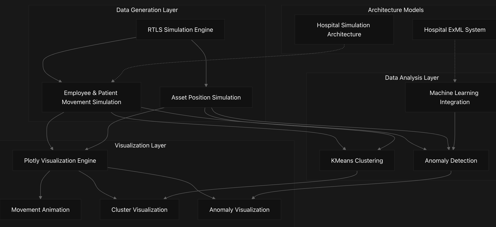
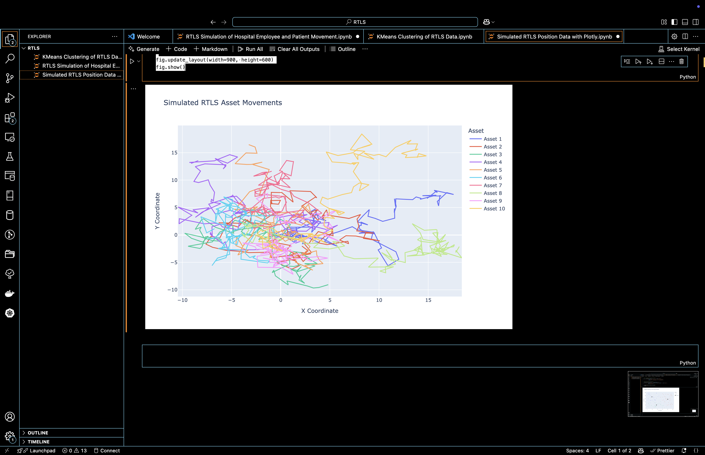
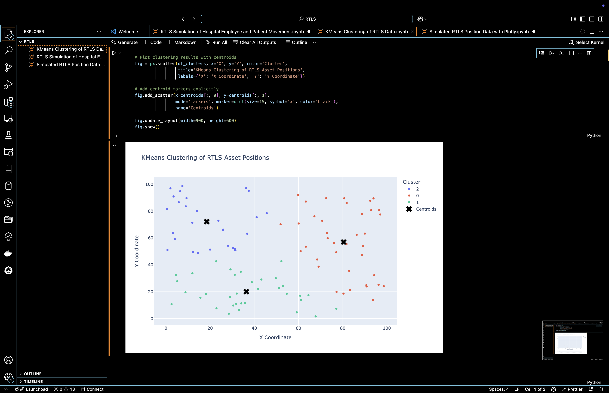
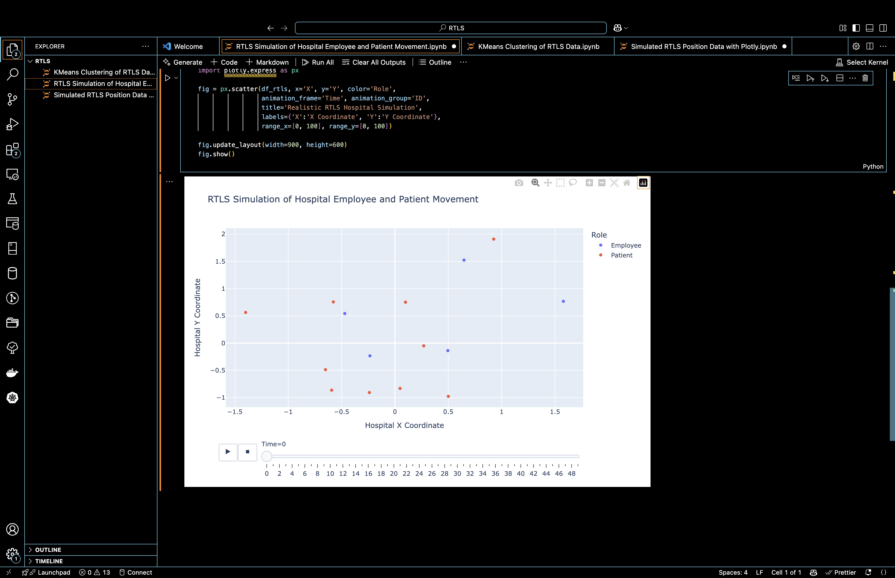
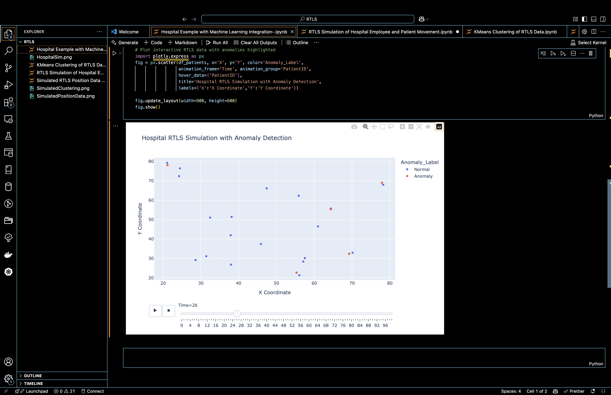

# RTLS_SIMS Overview
This document provides a comprehensive introduction to the RTLS_SIMS repository, which serves as a toolkit for simulating Real-Time Location Systems (RTLS) in hospital environments and analyzing the generated data. RTLS_SIMS enables users to generate realistic movement data for hospital staff, patients, and assets, then apply various analytical techniques to extract insights from this data.

## Purpose and Scope
The RTLS_SIMS repository serves several key purposes:

1. To simulate realistic RTLS position data using random walk algorithms and hospital-specific constraints
2. To demonstrate analytical techniques for identifying patterns in spatial positioning data
3. To visualize movement patterns, clusters, and anomalies using Plotly
4. To provide a framework for integrating machine learning for anomaly detection in hospital RTLS data

This overview provides a high-level understanding of the system components and their relationships. For detailed explanations of specific components, refer to their respective wiki pages.

## System Architecture
High-Level System Organization
The RTLS_SIMS system is organized into four functional layers that work together to generate, process, analyze, and visualize RTLS data.

## Data Flow Architecture
The following diagram illustrates how data flows through the RTLS_SIMS system, from simulation parameters to visualized insights.
! [Screenshot](DFA.png)

## Data Analysis Components
The analysis components extract insights from the simulated RTLS data:

Component	Description	Details
KMeans Clustering	Identifies patterns and clusters in spatial positioning data	For more details, see KMeans Clustering
Anomaly Detection	Uses machine learning to identify unusual movement patterns	For more details, see Anomaly Detection
Feature Engineering	Transforms raw position data into features suitable for analysis	Used to prepare data for clustering and anomaly detection
Sources: "Hospital Example with Machine Learning Integration-.ipynb"

## Component Interaction Model
The following class diagram illustrates the conceptual components of the system and how they interact:
! [Screenshot](CIM.png)

## Repository Structure
The RTLS_SIMS repository is primarily organized as a collection of Jupyter notebooks, each focusing on a specific aspect of the RTLS simulation and analysis:
! [Screenshot](RS.png)

Key Technological Features
The RTLS_SIMS system leverages several technological approaches to deliver its functionality:

1. Simulation Techniques
- Random walk algorithms for generating movement data
- Hospital-specific constraints to ensure realistic movement patterns
- Parametric control over movement characteristics

2. Analysis Approaches
- KMeans clustering for identifying spatial patterns
- Machine learning integration for anomaly detection
- Feature engineering for enhancing raw position data

3. Visualization Capabilities
- Interactive Plotly visualizations for exploring data
- Animation capabilities for visualizing movement over time
- Color-coded cluster and anomaly visualization

System Design Principles
The RTLS_SIMS system exhibits several key design principles:

1. Modular Design: The system separates data generation, processing, analysis, and visualization into distinct components.
2. Visualization-Centric: Plotly visualizations are a central feature, enabling interactive exploration of the simulated data.
3. Machine Learning Integration: The system incorporates machine learning techniques for both clustering and anomaly detection.
4. Simulation Foundation: The core relies on simulation techniques (particularly random walks) to generate realistic RTLS data.
5. Hospital Context Modeling: Hospital-specific constraints and models make the simulations more realistic for healthcare applications.

# Code Notebooks
# Example 1: Simulated RTLS Position Data
This code simulates location data of multiple assets moving randomly within a defined space:

	#Simulated RTLS Position Data with Plotly
	
	import numpy as np
	import pandas as pd
	import plotly.express as px
	
	#Simulation parameters
	
	np.random.seed(42)
	num_assets = 10
	num_timesteps = 100
	
	#Generate random walk data for assets
	
	positions = np.cumsum(np.random.randn(num_timesteps, num_assets, 2), axis=0)
	
	#Create DataFrame for Plotly
	
	data = []
	for asset in range(num_assets):
	    df_asset = pd.DataFrame({
	        'X': positions[:, asset, 0],
	        'Y': positions[:, asset, 1],
	        'Time': range(num_timesteps),
	        'Asset': f'Asset {asset + 1}'
	    })
	    data.append(df_asset)
	
	df_positions = pd.concat(data)
	
	#Plot asset movements
	
	fig = px.line(df_positions, x='X', y='Y', color='Asset',
	              title='Simulated RTLS Asset Movements',
	              labels={'X': 'X Coordinate', 'Y': 'Y Coordinate'})
	
	fig.update_layout(width=900, height=600)
	fig.show()
	
	
	
# Example 2
# KMeans Clustering of RTLS Data with Plotly
	
	import numpy as np
	import pandas as pd
	import plotly.express as px
	from sklearn.cluster import KMeans
	
	#Simulated RTLS data
	np.random.seed(42)
	positions = np.random.rand(100, 2) * 100  # Random positions in a 100x100 area
	
	#Perform KMeans clustering
	kmeans = KMeans(n_clusters=3, random_state=42).fit(positions)
	labels = kmeans.labels_
	centroids = kmeans.cluster_centers_
	
	#Create DataFrame for Plotly
	df_clusters = pd.DataFrame({
	    'X': positions[:, 0],
	    'Y': positions[:, 1],
	    'Cluster': labels.astype(str)
	})
	
	#Plot clustering results with centroids
	fig = px.scatter(df_clusters, x='X', y='Y', color='Cluster',
	                 title='KMeans Clustering of RTLS Asset Positions',
	                 labels={'X': 'X Coordinate', 'Y': 'Y Coordinate'})
	
	#Add centroid markers explicitly
	fig.add_scatter(x=centroids[:, 0], y=centroids[:, 1],
	                mode='markers', marker=dict(size=15, symbol='x', color='black'),
	                name='Centroids')
	
	fig.update_layout(width=900, height=600)
	fig.show()
	

	
# Example 3
# Scenario:
•	Employees and patients wear badges tracked via RTLS.
•	Hospital management wants to understand:
•	Employee workflow patterns (e.g., nurses/doctors).
•	Patient movement patterns for safety and service optimization.
	
	# Python RTLS Hospital Simulation (with Boundaries and Realistic Movement)
	
	import numpy as np
	import pandas as pd  # <-- Previously missing import
	import plotly.express as px
	
	#Simulation parameters
	
	np.random.seed(42)
	num_employees = 5
	num_patients = 10
	num_timesteps = 50
	
	#Employee movement (larger random walk within hospital)
	
	def simulate_employee_movement():
	    positions = np.zeros((num_timesteps, num_employees, 2))
	    positions[0] = np.random.uniform(20, 80, size=(num_employees, 2))
	
	    for t in range(1, num_timesteps):
	        step = np.random.randn(num_employees, 2) * 2
	        positions[t] = positions[t-1] + step
	        positions[t, :, 0] = np.clip(positions[t, :, 0], 0, 100)
	        positions[t, :, 1] = np.clip(positions[t, :, 1], 0, 100)
	    return positions
	
	#Patient movement (restricted near room)
	
	def simulate_patient_movement():
	    positions = np.zeros((num_timesteps, num_patients, 2))
	    patient_rooms = np.random.uniform(30, 70, size=(num_patients, 2))
	
	    for t in range(num_timesteps):
	        step = np.random.randn(num_patients, 2) * 0.5
	        positions[t] = patient_rooms + step
	        positions[t, :, 0] = np.clip(positions[t, :, 0], patient_rooms[:, 0]-3, patient_rooms[:, 0]+3)
	        positions[t, :, 1] = np.clip(positions[t, :, 1], patient_rooms[:, 1]-3, patient_rooms[:, 1]+3)
	    return positions
	
	#Define parameters explicitly
	
	num_timesteps = 100
	employee_positions = simulate_employee_movement()
	patient_positions = simulate_patient_movement()
	
	#Import pandas explicitly
	
	import pandas as pd  
	
	#Convert data into DataFrame
	
	def positions_to_df(positions, role):
	    data = []
	    num_entities = positions.shape[1]
	    for entity in range(num_entities):
	        df_entity = pd.DataFrame({
	            'X': positions[:, entity, 0],
	            'Y': positions[:, entity, 1],
	            'Time': np.arange(num_timesteps),
	            'Role': role,
	            'ID': f'{role}_{entity+1}'
	        })
	        data.append(df_entity)
	    return pd.concat(data)
	
	#Parameters explicitly defined
	
	num_timesteps = 100
	num_employees = 5
	num_patients = 10
	
	#Simulate
	
	employee_positions = simulate_employee_movement()
	patient_positions = simulate_patient_movement()
	
	#Combine into one dataframe
	
	import pandas as pd  # Explicitly ensuring this is imported
	df_employees = positions_to_df(employee_positions, 'Employee')
	df_patients = positions_to_df(patient_positions, 'Patient')
	df_rtls = pd.concat([df_employees, df_patients])
	
	#Visualization using Plotly
	import plotly.express as px
	
	fig = px.scatter(df_rtls, x='X', y='Y', color='Role', 
	                 animation_frame='Time', animation_group='ID',
	                 title='Realistic RTLS Hospital Simulation',
	                 labels={'X':'X Coordinate', 'Y':'Y Coordinate'},
	                 range_x=[0, 100], range_y=[0, 100])
	
	fig.update_layout(width=900, height=600)
	fig.show()
	
	
	# Potential Real-World Applications from This Simulation:
		•	Workflow Efficiency:
		•	Identify bottlenecks or inefficient paths used by medical staff.
		•	Optimize staffing based on area density over time.
		•	Patient Safety and Care:
		•	Quickly locate wandering or lost patients (e.g., elderly, dementia patients).
		•	Alert staff if a patient enters a restricted area.
		•	Contact Tracing and Infection Control:
		•	Track potential exposure pathways during an outbreak.
	
# Example 4
A practical ML approach is to detect anomalies in patient movements, alerting staff if a patient deviates significantly from their usual pattern. For instance, if a patient begins to wander unexpectedly (potentially indicating confusion, distress, or risk of elopement), your model would highlight it proactively.
	
	# ML Integration Plan:
	
	1. Generate Simulated RTLS Data (use your current setup)
		•	Generate normal patient movements (restricted near rooms).
		•	Introduce an “anomalous” patient who randomly leaves the permitted zone.
	
	2. Feature Engineering
		•	Compute features like distance traveled per timestep, total displacement from room, or velocity.
		•	Label data as normal or anomalous.
	
	2. Train an Anomaly Detection Model
		•	Use Isolation Forest (unsupervised anomaly detection) to detect unusual patient movements.
	
	# Hospital Example with Machine Learning Integration
	import numpy as np
	import pandas as pd
	import plotly.express as px
	from sklearn.ensemble import IsolationForest
	
	# Set random seed
	np.random.seed(42)
	
	# Simulation parameters
	num_patients = 20
	num_timesteps = 100
	anomalous_patient_idx = 0  # First patient is anomalous
	
	# Simulate patient movements (normal and anomalous)
	def simulate_patient_movement(num_patients, num_timesteps, anomalous_patient=None):
	    patient_rooms = np.random.uniform(20, 80, size=(num_patients, 2))
	    positions = np.zeros((num_timesteps, num_patients, 2))
	
	    for t in range(num_timesteps):
	        movement = np.random.randn(num_patients, 2) * 0.5
	        positions[t] = patient_rooms + movement
	        positions[t,:,0] = np.clip(positions[t,:,0], patient_rooms[:,0]-3, patient_rooms[:,0]+3)
	        positions[t, :,1] = np.clip(positions[t,:,1], patient_rooms[:,1]-3, patient_rooms[:,1]+3)
	
	    # Inject anomaly: patient moves linearly away from room
	    if anomalous_patient is not None:
	        anomaly_path = np.linspace([0, 0], [40, 40], num_timesteps)
	        positions[:, anomalous_patient] = patient_rooms[anomalous_patient] + anomaly_path
	
	    return positions, patient_rooms
	
	# Generate data
	positions, patient_rooms = simulate_patient_movement(num_patients, num_timesteps, anomalous_patient=anomalous_patient)
	
	# Convert positions to DataFrame
	data = []
	for patient in range(num_patients):
	    for t in range(num_timesteps):
	        data.append({
	            'PatientID': f'Patient_{patient+1}',
	            'X': positions[t, patient, 0],
	            'Y': positions[t, patient, 1],
	            'Time': t
	        })
	
	df_patients = pd.DataFrame(data)
	
	# Feature Engineering: Calculate movement speed per patient
	df_patients.sort_values(['PatientID', 'Time'], inplace=True)
	df_patients['Prev_X'] = df_patients.groupby('PatientID')['X'].shift(1)
	df_patients['Prev_Y'] = df_patients.groupby('PatientID')['Y'].shift(1)
	df_patients['Distance'] = np.sqrt((df_patients['X'] - df_patients['Prev_X'])**2 +
	                                  (df_patients['Y'] - df_patients['Prev_Y'])**2).fillna(0)
	
	# Isolation Forest to detect anomalies
	from sklearn.ensemble import IsolationForest
	
	features = df_patients[['X', 'Y', 'Distance']].fillna(0)
	iso_forest = IsolationForest(contamination=0.05, random_state=42)
	df_patients['Anomaly'] = iso_forest.fit_predict(features)
	df_patients['Anomaly_Label'] = df_patients['Anomaly'].apply(lambda x: 'Anomaly' if x==-1 else 'Normal')
	
	# Plot interactive RTLS data with anomalies highlighted
	import plotly.express as px
	fig = px.scatter(df_patients, x='X', y='Y', color='Anomaly_Label',
	                 animation_frame='Time', animation_group='PatientID',
	                 hover_data=['PatientID'],
	                 title='Hospital RTLS Simulation with Anomaly Detection',
	                 labels={'X':'X Coordinate','Y':'Y Coordinate'})
	
	fig.update_layout(width=900, height=600)
	fig.show()

	
# What This Code Demonstrates Clearly:
•	Realistic patient movements (confined near rooms).
•	Anomaly detection using Isolation Forest (unsupervised ML to identify patients with unusual movements).
•	Interactive visualization highlighting anomalous patient movements effectively.

